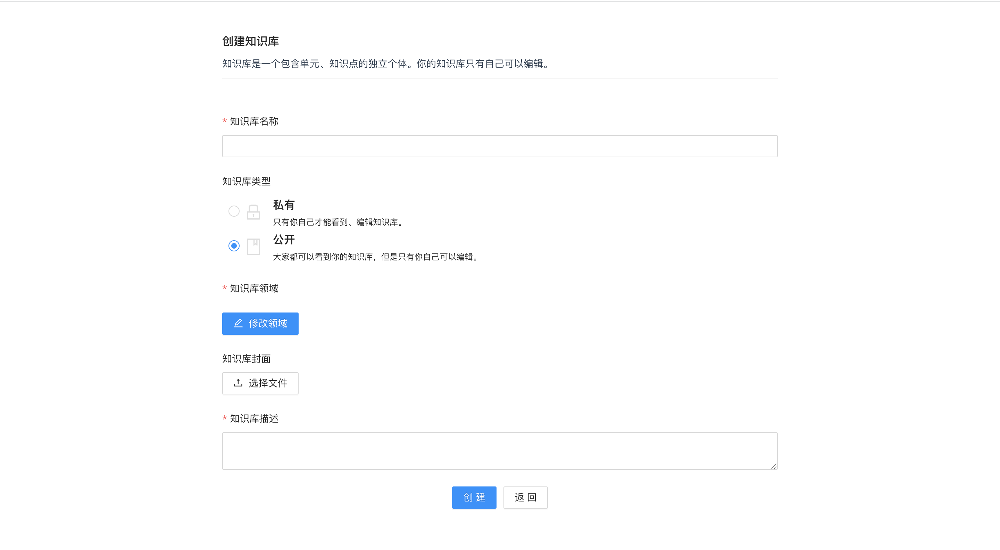

## 创建知识库

当您登录后可以创建自己的知识库。

您可以在首页侧边栏点击创建按钮进入创建知识库页面。

> 知识库是一个包含单元、知识点的独立个体。你的知识库只有自己可以编辑。

- 知识库名称是必需的。
- 知识库分为 ***公开*** 和 ***私有***
  - 公开知识库可以被大家看到，并且允许被克隆
  - 私有知识库只有您自己能看到
- 您应当为知识库指定一个领域，这样可以方便更多人通过领域分类找到它
- 您可以为知识库上传一张封面图，使您的知识库看起来更加饱满
- 一段准确的描述对于知识库来说至关重要，大家给可以了解您建立这个知识库的初衷

当您创建好知识库后，会跳转至知识库编辑面板。

## Roadmap

- 公开知识库，用户将可以选择是否允许***克隆***
