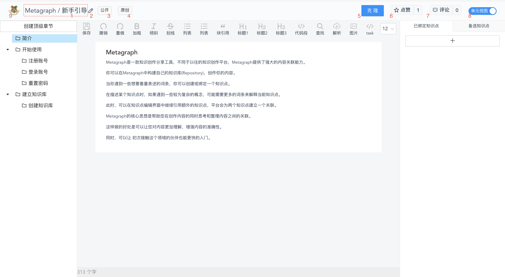

## 知识库编辑面板-头部

### 编辑面板头部功能

> 下文按图片中的红色序号展开

- 知识库编辑面板标题( 1 )，知识库编辑面板标题由 ***用户名*** + ***知识库名*** 构成
- 知识库编辑入口( 2 )，点击跳转进入 ***知识库信息编辑页***。 
- 知识库 ***开放*** 属性( 3 )️，标识知识库是 ***公开*** 还是 ***私有*** 的。
- 知识库 ***原创*** 属性( 4 )，标识知识库是 ***原创*** 还是 ***克隆*** 的。
- 知识库 ***克隆*** 按钮( 5 )。
  - 知识库作者决定知识库是否允许克隆；
  - 只有 登录用户 才能克隆知识库；  
- 知识库 ***点赞*** 按钮( 6 )。
    - 按钮分为左右两个部分，
    - 左侧控制 ***点赞*** 或 ***取消点赞***
    - 右侧展示 ***点赞量*** ，点击后页面右侧弹出 ***点赞详情列表*** 。
    - 登录用户可以 ***点赞*** 或 ***取消点赞***
- 知识库 ***评论*** 按钮( 7 )。
    - 按钮左侧仅显示操作文案
    - 按钮右侧展示 ***评论总数*** ，点击后页面右侧弹出 ***评论详情列表*** 。
    - 登录用户可进行 ***评论*** 或 ***回复***
- 知识库 ***视图切换*** 按钮( 8 )。
   - 单元视图
   - 图谱模式
- 平台 logo ( 9 ) ，点击返回首页。

### 评论按钮

### 点赞按钮
